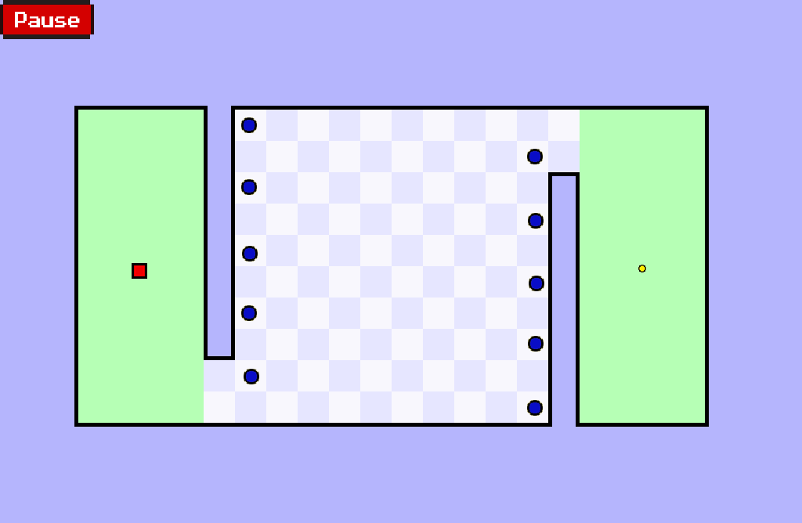

# SnubbyLand


```
$ git clone https://github.com/Abdellatif-AitHammadi/SnubbyLand.git
$ cd SnubbyLand/src
$ g++ -o game main.cpp -lSDL2  -lSDL2_image  -lm -lboost_serialization -lSDL2_ttf 
$ ./game @id
```





# [snubbyland server](http://snubbyland.herokuapp.com/api)


