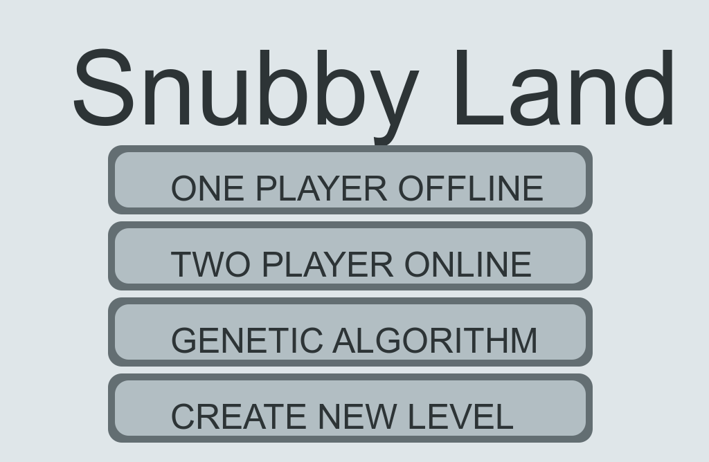
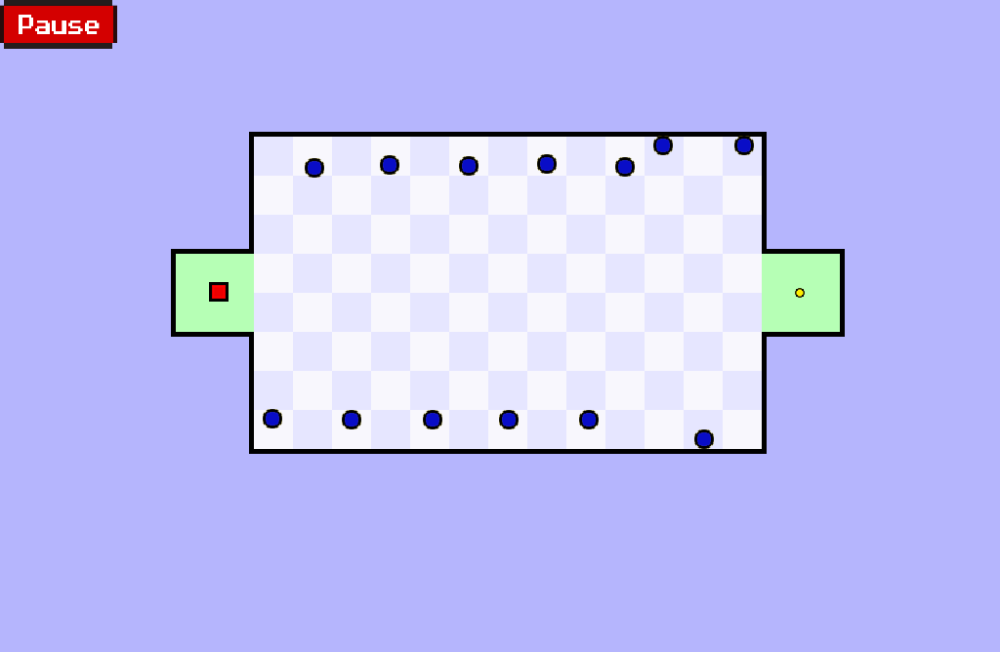
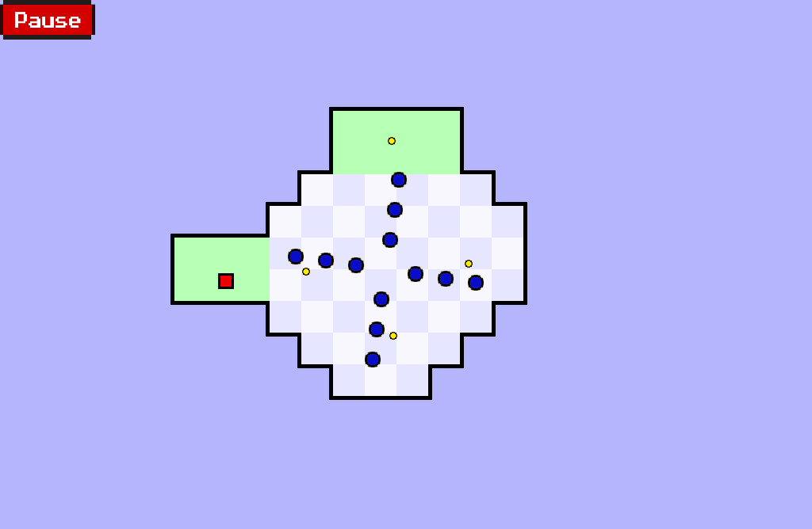
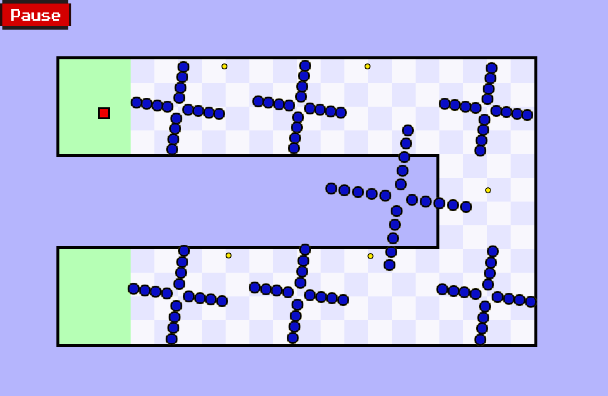

# SnubbyLand

<!-- [Report](https://www.overleaf.com/read/vvppvyhymjhv)

## Level 1

## Level 2

## Level 3

## Level 4

## Level 5

## Level 6

## Level 7

# ONLINE 2 PLAYER

# genetic algorithm

 -->

<!-- [17:34, 25/05/2020] Ess: -Presentation du jeu
[17:34, 25/05/2020] Ess: -Concenption
[17:34, 25/05/2020] Ess: -Resultats (photos de jeu)
[17:34, 25/05/2020] Ess: -Simulation (video de jeu khdam)
[17:35, 25/05/2020] Ess: f presentation: principe de jeu, modes, regles de winning
conception : resume d dakchi li f conception d rapport
 -->

# Presentation du jeu

The World's Hardest Game est un jeu 2D jeu à un joueur stimulant développé par Snubby Land en 2008. L'objectif de ce jeu est de déplacer le carré et d'esquiver les cercles bleus. Vous commencez dans une zone verte et votre objectif est d'arriver à une autre zone verte avec toutes les pièces. Mais beaucoup d'ennemis vous empêcheront d'y arriver, vous devez donc les esquiver avec vos touches fléchées pour y arriver.

# Concenption

# Resultats (photos de jeu)

[image one player offline]

# Simulation
